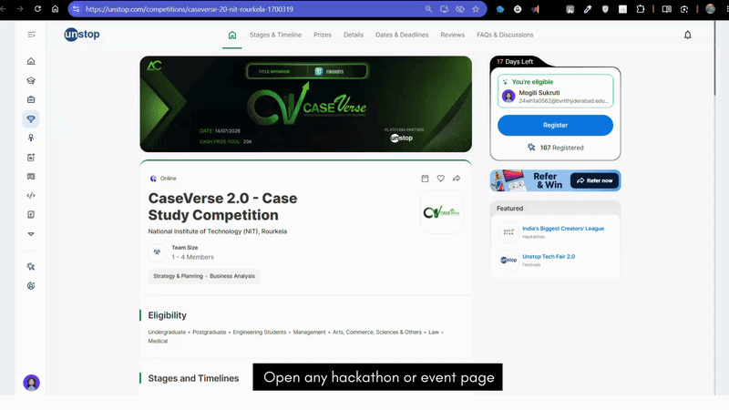

# ChimeIn

A lightweight Chrome Extension that helps you never miss a hackathon or competition deadline again. It automatically scans hackathon webpages using AI, extracts important milestones, and adds them directly to your Google Calendar with customizable reminders.

## Project Overview

ChimeIn is a minimal browser extension that:
* **Scrapes Webpages:** Extracts readable text directly from active hackathon or competition tabs.
* **Extracts Timelines:** Uses Groq's `llama-3.3-70b-versatile` model to find milestones like registration deadlines, submission targets, and presentation dates.
* **Review UI:** Provides a sidebar panel where you can double-check dates, edit names, or select custom notification frequencies.
* **Calendar Sync:** Uses the Google Calendar API via OAuth2 to bulk-push confirmed items onto your calendar in one click.
* **Deduplication:** Proactively cross-references your current session history to make sure you don't save duplicate schedules.

---
## Demo

<p align="center">
  
</p>

---

## Project Structure

```text
ChimeIn/
├── ai/
│   ├── parser.js              
│   └── prompt-template.js     
├── background/
│   ├── auth.js                
│   ├── calendar.js            
│   ├── config.example.js      
│   └── service-worker.js       
├── content/
│   └── extractor.js            
├── sidebar/
│   ├── milestone-card.js       
│   ├── reminder-picker.js      
│   ├── sidebar.css             
│   ├── sidebar.html           
│   └── sidebar.js              
├── utils/
│   ├── constants.js            
│   └── duplicate-check.js     
├── .env.example               
├── .gitignore
└── manifest.json

```

## Tech Stack

| Layer | Technology | Purpose |
| :--- | :--- | :--- |
| **Extension Framework** | Web Extensions Manifest V3 | Handles side-panels and background tasks natively. |
| **Frontend UI** | JavaScript (ES Modules) + CSS | Clean, fast, zero-dependency pop-out side view. |
| **AI Inference** | Groq API (`llama-3.3-70b`) | Rapid sub-second chronological data structuring. |
| **Integrations** | Google Calendar v3 REST API | Native authentication using OAuth2 flows. |
| **State Storage** | Chrome Storage API | Handles local verification and duplicates securely. |

---

## Setup Instructions
### 1. Clone the Repository
```bash
git clone [https://github.com/sukrutimogili/ChimeIn.git](https://github.com/sukrutimogili/ChimeIn.git)
cd ChimeIn

```
### 2. Configure Environment Keys & Secrets
First, configure your environment files using the blueprints provided:

```bash
cp .env.example .env
cp background/config.example.js background/config.js
```

* #### .env Configurations
  Fill out your root .env file with your credentials:
  ```bash
  GROQ_API_KEY=gsk_your_groq_api_token_here
  GOOGLE_CLIENT_ID=your_google_cloud_console_oauth_client_id.apps.googleusercontent.com
  EXTENSION_ID=your_deployed_chrome_extension_id_here
  ```
* #### Extension File Configurations
  Open background/config.js and set your key:
  ```bash
  export const GROQ_API_KEY = "your_groq_key_here";
  ```
  Open manifest.json and insert your Google client ID under the oauth2 parameter:
  ```bash
  "oauth2": {
    "client_id": "YOUR_GOOGLE_CLIENT_ID.apps.googleusercontent.com",
    "scopes": ["[https://www.googleapis.com/auth/calendar.events](https://www.googleapis.com/auth/calendar.events)"]
  }
  ```

### 3. Load Extension into Chrome
1. Open Chrome and navigate to chrome://extensions/.
2. Turn on Developer mode via the slider in the top right corner.
3. Click Load unpacked in the top left corner.
4. Select the ChimeIn root project folder directory.
